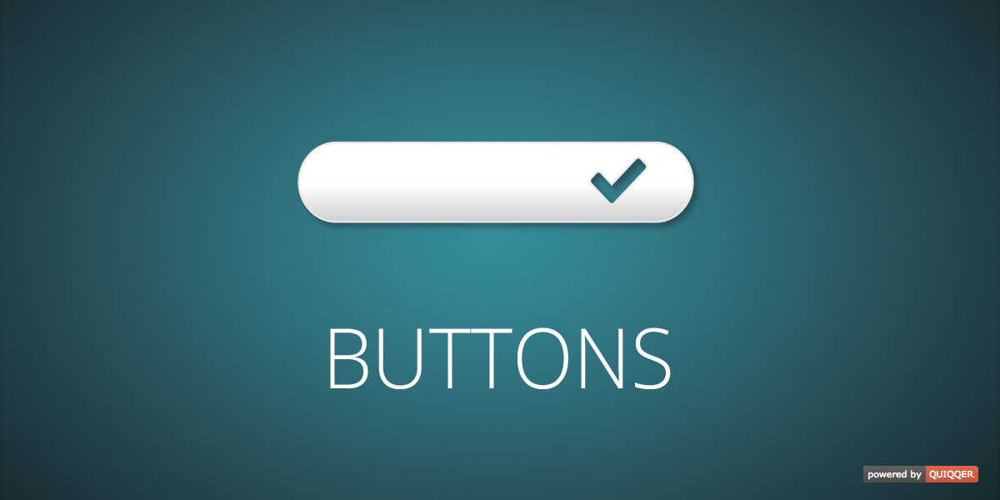

QUIQQER CSS Button Klassen
========

Liefert CSS Klassen für a-Links. Erweitert den Inhaltseditor um Button Stile.
Der Benutzer kann somit auf a-Links als Buttons darstellen lassen 

Paketname:

    quiqqer/buttons

Features
--------

- CSS Button Klassen für a-Links

Installation
------------

Der Paketname ist: quiqqer/buttons

Mitwirken
----------

- Issue Tracker: https://dev.quiqqer.com/quiqqer/package-buttons/issues
- Source Code: https://dev.quiqqer.com/quiqqer/package-buttons

Support
-------

Falls Sie ein Fehler gefunden haben oder Verbesserungen wünschen,
Dann können Sie gerne an support@pcsg.de eine E-Mail schreiben.

Entwickler
-------

- Code Standard: PSR2

License
-------

- GPL-3.0+
